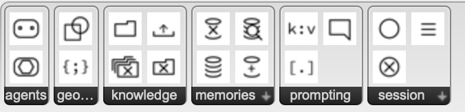

# GH Agno Agents

Backend + Grasshopper user objects for running Agno agents. Follow the steps below even if you’re new to FastAPI, Python, or Grasshopper.

## Get the code
Clone or pull the repo to your machine:
- First time: `git clone https://github.com/johanesmikhael/gh_agno_agents.git && cd gh_agno_agents`
- Already have it: `git pull` inside the repo folder.

## What you need
- Python 3.10+ installed (check with `python --version`).
- An OpenAI API key.
- Rhino8 installed.
- A terminal (macOS Terminal, Windows PowerShell).

## 1) Get the backend running
1. **Copy the env template and add your key**
   - In the repo root run: `cp template_env .env`
   - Open `.env` and set `OPENAI_API_KEY=your-real-key`.
2. **(Recommended) create and activate a virtualenv**
   - macOS/Linux: `python -m venv .venv && source .venv/bin/activate`
   - Windows PowerShell: `python -m venv .venv ; .\.venv\Scripts\Activate.ps1`
   - To reactivate later: `source .venv/bin/activate` (macOS/Linux) or `.\.venv\Scripts\Activate.ps1` (Windows PowerShell).
3. **Install Python packages**
   - `pip install -r requirements.txt`
   - If `fastapi` command is missing later: `pip install "fastapi[standard]"`
4. **Create local data folders (gitignored)**
   - `mkdir -p agents_db/json_db agents_db/knowledge_db lancedb`
   - This is safe to run even if they already exist; the code assumes the paths are present and may not create them for you.
5. **Start the API (development mode)**
   - From the repo root: `fastapi dev agents.py --host 0.0.0.0 --port 8000`
   - Leave this terminal running.
6. **Check it works**
   - Open `http://localhost:8000/docs` in a browser. You should see FastAPI docs.

## 2) Connect Grasshopper
1. **Install the user objects**
   - In Grasshopper go to `File` → `Special Folders` → `User Object Folder`.
   - Copy the entire `GH_Agno` folder from `gh_user_objects/` into that folder.
   - Manual paths if needed:  
     - macOS: `~/Library/Application Support/McNeel/Rhinoceros/<version>/Plug-ins/Grasshopper/UserObjects`  
     - Windows: `%APPDATA%\Grasshopper\UserObjects`
2. **Tell Rhino where to find this repo (Python 3 path)**
   - Rhino Script Editor → `Tools` → `Options` → `Python` → `Module Search Paths` → add the absolute path to this repo (`gh_agno_agents`).
   - Get the path via `pwd` (macOS/Linux) or `Get-Location` (Windows PowerShell).
3. **Use the components**
   - Keep the API server running from step 5 above.
   - Open an example in `rhino_gh` (e.g., `gh_script_v1.gh`) and place the GH_Agno components.
   - Components call the API at `http://localhost:8000`.

## How it looks in Grasshopper

## Quick tips
- If something fails, check the terminal running `fastapi dev` for errors.
- To stop the server, press `Ctrl+C` in that terminal.
- If the key doesn’t load, confirm `.env` is in the repo root and contains `OPENAI_API_KEY`.
